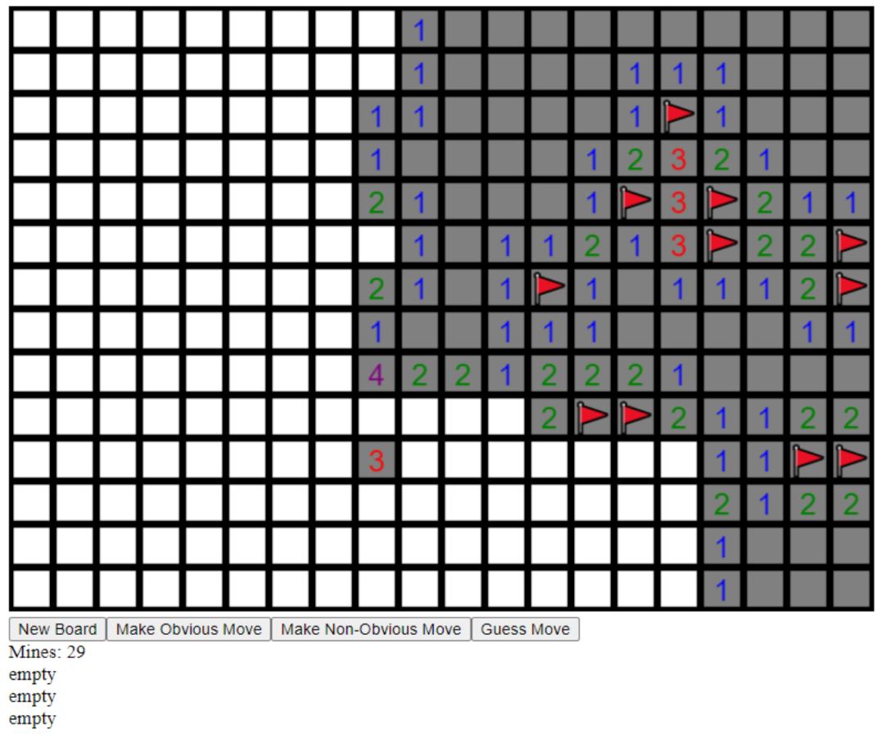

# Minesweeper in Haskell

A minesweeper clone written in Haskell featuring flagging, auto opening of spaces and an AI player based on matrices

## Structure

Main.hs implements the GUI

minesweeper.hs has the game logic

AIPlayer.hs has the AI logic

Explainer document in the repo as Minesweeper.pdf
